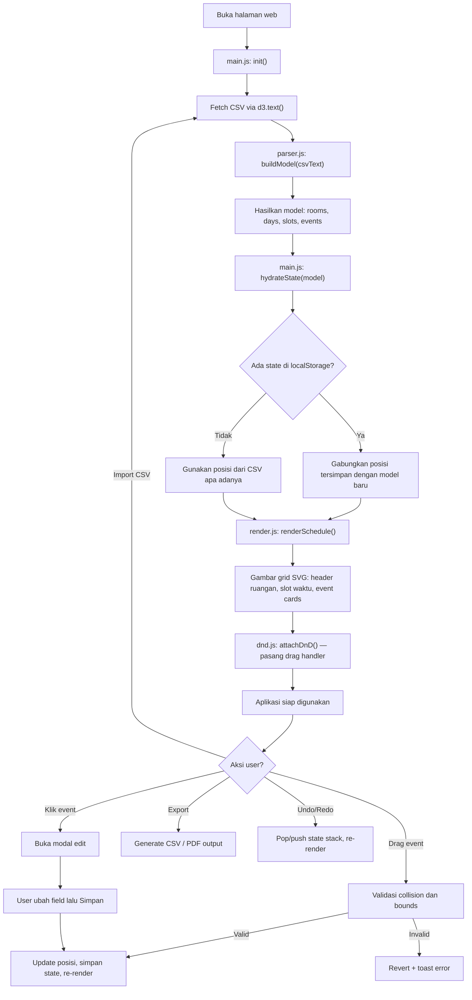
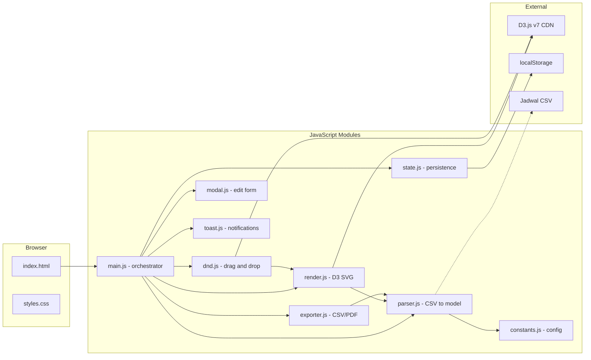

# 📋 Dokumentasi Project — Visual Scheduler Jadwal Gasal

## 1. Ringkasan Project

Aplikasi web untuk **visualisasi dan pengelolaan jadwal kuliah** Program Studi Teknik Informatika. Data jadwal di-import dari file CSV, ditampilkan dalam grid SVG interaktif menggunakan **D3.js**, lalu bisa diedit secara visual dan di-export kembali ke CSV atau PDF.

### Tech Stack

| Komponen | Teknologi |
|----------|-----------|
| Rendering | D3.js v7 (CDN via ESM) |
| Layout | SVG (Scalable Vector Graphics) |
| Styling | Vanilla CSS (CSS Variables / Design Tokens) |
| Logic | Vanilla JavaScript (ES Modules) |
| State | localStorage + in-memory undo/redo stack |
| Server | Node.js http server sederhana (dev only) |

---

## 2. Struktur File

```
KP/
├── index.html                          # Entry point HTML
├── Jadwal Gasal 25_26.csv              # Data input CSV asli
├── jadwal_gasal_25_26_clean_matrix.csv  # Data CSV format matrix (legacy)
└── src/
    ├── constants.js   # Konfigurasi global (layout, storage key, slot duration)
    ├── parser.js      # Parser CSV → model data (rooms, days, slots, events)
    ├── render.js      # Render SVG grid + event cards via D3.js
    ├── dnd.js         # Drag-and-drop logic (snap to grid, collision detection)
    ├── modal.js       # Edit modal UI (form fields, save handler)
    ├── state.js       # State management (localStorage + undo/redo stack)
    ├── exporter.js    # Export ke CSV (format asli) dan PDF (print-ready)
    ├── toast.js       # Toast notification system
    └── styles.css     # Semua styling (dark theme, modal, toast, SVG)
```

---

## 3. Alur Kerja Aplikasi



---

## 4. Penjelasan Setiap Modul

### 4.1 constants.js — Konfigurasi Global

Semua "magic numbers" dipusatkan di sini agar mudah diubah tanpa menyentuh logika.

| Konstanta | Nilai | Keterangan |
|-----------|-------|------------|
| `STORAGE_KEY` | `"d3-jadwal-state-v1"` | Key untuk localStorage |
| `DEFAULT_CSV_URL` | `"/Jadwal Gasal 25_26.csv"` | Path CSV yang di-load otomatis |
| `SLOT_MINUTES` | `50` | Durasi 1 slot waktu (menit) |
| `REST_START_TIME` | `"12:00"` | Waktu mulai istirahat |
| `MAX_UNDO_STEPS` | `30` | Maksimum langkah undo |
| `LAYOUT` | `{ margin, dayLabelW, timeColW, ... }` | Dimensi layout SVG (piksel) |

**Layout SVG:**
- `colW: 200` — lebar kolom per ruangan
- `rowH: 38` — tinggi per slot waktu
- `headerH: 38` — tinggi header nama ruangan
- `dayGap: 28` — jarak vertikal antar section hari

---

### 4.2 parser.js — Parser CSV ke Model Data

**Fungsi utama:** `buildModel(csvText)` — menerima raw CSV text, menghasilkan objek model.

#### Format CSV Input

CSV asli **bukan** format standar header-data. Strukturnya multi-section:

```
Baris 0: ,,Jadwal Gasal Teknik Informatika 2025/2026,...
Baris 1: (kosong)
Baris 2: ,,407,406,306,304,203,Lab TIA,LAB CC,...    ← ROOM HEADER
Baris 3: SENIN,07:00 - 07:50,Basis Data I C (IF 3)...  ← DATA
Baris 4: ,07.50 - 08.40,,,...                          ← DATA (hari kosong = lanjutan)
...
Baris 16: (kosong — pemisah antar hari)
Baris 17: ,,407,406,306,...                             ← ROOM HEADER ulang
Baris 18: SELASA,07:00 - 07:50,...                      ← DATA hari berikutnya
```

#### Alur Parsing

1. **`parseCsvRaw(text)`** — parse CSV mentah menjadi array 2D `grid[row][col]`, handle quoted fields
2. **`extractRooms(roomRow)`** — baca nama ruangan dari kolom 2–10, plus kolom 11 (Lab Sos/Sister)
3. **`extractSlots(grid, startIdx)`** — kumpulkan label waktu dan `slotStarts` (menit) dari hari pertama
4. **`extractEvents(grid, ...)`** — iterasi semua baris data, parse setiap sel yang berisi ` / `

#### Parsing Sel Event

Setiap sel berisi teks seperti:
```
Basis Data I C (IF 3) - Senin / 07:00 - 09:30 / 407 / Meidya
```

**`parseCellMeta(cellText)`** mengekstrak:
- `mata_kuliah`: "Basis Data I"
- `kelas`: "C"
- `prodiTag`: "IF 3"
- `dosen`: "Meidya"

**`parseRangeFromText(text)`** mengekstrak waktu: `07:00 - 09:30` → `{ start: 420, end: 570 }`

#### Penghitungan spanRows

```javascript
function countSlotsCovered(slotStarts, startMin, endMin) {
  return Math.max(1, slotStarts.filter(s => s >= startMin && s < endMin).length);
}
```

Menghitung berapa slot yang benar-benar dicakup. Contoh: MK 07:00–09:30 mencakup 3 slot (07:00, 07:50, 08:40), jadi `spanRows = 3`.

#### Output Model

```javascript
{
  rooms:      ["407", "406", "306", "304", "203", "Lab TIA", ...],
  days:       ["SENIN", "SELASA", "RABU", "KAMIS", "JUMAT"],
  slots:      ["07:00 - 07:50", "07.50 - 08.40", ...],
  slotStarts: [420, 470, 520, ...],  // menit dari 00:00
  restIndex:  6,                     // index slot istirahat
  events:     [{ id, hari, room, startMin, endMin, startRow, spanRows, ... }, ...]
}
```

---

### 4.3 render.js — Render Grid SVG

**Fungsi utama:** `renderSchedule(svgEl, model, state, opts)`

#### Proses Rendering

1. **Hitung dimensi SVG** berdasarkan jumlah rooms x colW dan days x slots x rowH
2. **Buat `dayLayouts`** — posisi x/y setiap section hari
3. **`drawDay()`** untuk setiap hari:
   - Label hari (rotasi vertikal -90 derajat)
   - Header nama ruangan (teks di atas grid)
   - Label waktu (di sisi kiri grid)
   - Grid lines horizontal dan vertikal
   - Band istirahat (merah) + teks "ISTIRAHAT"
4. **Render event cards:**
   - ClipPath per event (agar teks tidak meluber)
   - `<rect>` berwarna berdasarkan `colorKey` (D3 `scaleOrdinal`)
   - Teks judul dengan **auto word-wrap** (`wrapText()` → multi `<tspan>`)
   - Sub-info: jam, ruangan, dosen
   - Badge untuk konflik dosen
5. **Filter search** — event yang tidak cocok diberi `opacity: 0.12`

#### Word-Wrap SVG Text

SVG `<text>` tidak support word-wrap. Solusi:

```javascript
function wrapText(text, maxChars) {
  // Potong per kata, max ~29 karakter per baris
  // Return array of lines → each becomes a <tspan>
}
```

#### Validasi Posisi Event

```javascript
function eventXY(e) {
  // Return null jika: hari tidak ada, room tidak ditemukan, startRow out of bounds
  // Mencegah event "offside" di luar grid
}
```

Events dengan posisi invalid difilter sebelum rendering.

---

### 4.4 dnd.js — Drag-and-Drop

**Fungsi utama:** `attachDnD(renderCtx, model, state, onStateChange, onEventClick)`

#### Mekanisme

1. **`drag.start`**: simpan posisi asal (`__orig`), reset `__dragDist`
2. **`drag.drag`**: geser kartu secara visual, tampilkan drop hint (kotak biru transparan), akumulasi `__dragDist`
3. **`drag.end`**:
   - Jika `__dragDist < 5` → ini **klik**, bukan drag → panggil `onEventClick` (buka modal)
   - Jika ada gerakan → hitung target posisi dari pointer:
     - `resolveTarget(px, py, d)` → cari hari, ruangan, slot terdekat
     - Validasi: collision? out of bounds? rest zone?
     - Valid → commit posisi baru → `onStateChange({ reason: "drop" })`
     - Invalid → revert ke posisi asal → flash merah + toast error

#### Collision Detection

```javascript
function overlaps(a, b) {
  return a.hari === b.hari && a.room === b.room
      && a.startMin < b.endMin && b.startMin < a.endMin;
}
```

Cek apakah 2 event di ruangan dan hari yang sama saling overlap waktunya.

---

### 4.5 modal.js — Edit Modal

**Fungsi:** `initModal()` (sekali), `openModal(event, model, onSave)` (per klik)

#### Field yang bisa diedit:

| Field | Tipe | Keterangan |
|-------|------|------------|
| Mata Kuliah | text input | Nama MK |
| Kelas | text input | Huruf kelas (A, B, C, ...) |
| Prodi Tag | text input | Misal "IF 3", "IF 7" |
| Dosen | text input | Nama dosen |
| Hari | select | SENIN–JUMAT |
| Ruangan | select | Semua ruangan dari model |
| Jam Mulai | select | Slot waktu awal |
| Jam Selesai | select | Slot waktu akhir (menentukan durasi) |

#### Simpan

Saat "Simpan" diklik, `spanRows` dihitung ulang otomatis:
```javascript
const spanRows = Math.max(1, endIdx - startIdx);
```

---

### 4.6 state.js — State Management

#### localStorage

- **`saveState(state)`** — simpan `{ events: [...] }` ke `localStorage`
- **`loadState()`** — baca dari `localStorage`
- **`clearState()`** — hapus dari `localStorage`

#### Undo/Redo

Stack berbasis array in-memory, max 30 langkah:

```
pushUndo(state) → deep clone state, push ke undoStack, reset redoStack
undo(current)   → pop undoStack, push current ke redoStack
redo(current)   → pop redoStack, push current ke undoStack
```

Shortcut keyboard: **Ctrl+Z** (undo), **Ctrl+Y** (redo).

---

### 4.7 exporter.js — Export CSV dan PDF

#### Export Matrix CSV

`exportMatrix(model, state)` → memanggil `exportOriginal()`.

Menghasilkan CSV format sama seperti input asli:
```
,,Jadwal Gasal Teknik Informatika 2025/2026,...
,,...
,,407,406,306,304,203,...
SENIN,07:00 - 07:50,Basis Data I C (IF 3) - Senin / 07:00 - 09:30 / 407 / Meidya,...
,07.50 - 08.40,,,...
...
,12.00 - 13.00,I S T I R A H A T,...
```

#### Export PDF

`exportPdf(model, state)` → buka jendela baru dengan HTML table print-ready:
- Layout: A3 landscape, satu tabel per hari
- `page-break-inside: avoid` per hari
- Rowspan untuk event multi-slot
- Baris istirahat merah
- Auto print dialog via `window.print()`

---

### 4.8 toast.js — Notifikasi Toast

```javascript
showToast(message, type, durationMs)
// type: "error" | "success" | "warning" | "info"
```

- Muncul di kanan bawah layar
- Slide-in animation (CSS transition)
- Auto-dismiss setelah 3.5 detik
- 4 varian warna sesuai tipe

---

### 4.9 main.js — Orchestrator

File utama yang menghubungkan semua modul. Alur:

1. **`init()`** → `initModal()` → `loadFromUrl(CSV)` → `buildModel()` → `hydrateState()` → `reRender()`
2. **`reRender()`** → `renderSchedule()` → `attachDnD()` → `updateToolbar()` → `updateConflictInfo()`
3. **Event listeners:**
   - `fileInput.change` → import CSV baru
   - `resetBtn.click` → reset posisi ke asal
   - `undoBtn/redoBtn.click` → undo/redo
   - `exportMatrixBtn.click` → export CSV
   - `exportPdfBtn.click` → export PDF
   - `searchInput.input` → re-render dengan filter

#### Hydrate State

Saat load, cek localStorage. Jika ada saved state, **hanya posisi** (hari, room, startRow, startMin) yang diambil dari saved state. `spanRows` dan `endMin` selalu dari model terbaru (fresh parse) agar konsisten dengan data CSV.

---

### 4.10 styles.css — Styling

Menggunakan **CSS Variables (Design Tokens)** di `:root` untuk konsistensi warna:

```css
:root {
  --bg:      #0b0f14;    /* background utama */
  --panel:   #0f1621;    /* background panel/card */
  --text:    #e7eef7;    /* warna teks utama */
  --muted:   #93a4b8;    /* warna teks sekunder */
  --accent:  #4aa3ff;    /* warna aksen (biru) */
  --danger:  #ff3b30;    /* warna bahaya (merah) */
  --warning: #ffcc00;    /* warna peringatan (kuning) */
}
```

---

## 5. Fitur-Fitur

| # | Fitur | Keterangan |
|---|-------|------------|
| 1 | **Import CSV** | Baca format CSV asli multi-section (bukan standard header-data) |
| 2 | **Visualisasi Grid** | SVG grid per hari x ruangan x slot waktu |
| 3 | **Drag-and-Drop** | Pindahkan event antar slot/ruangan/hari dengan snap-to-grid |
| 4 | **Edit Modal** | Klik event → form edit MK, dosen, kelas, hari, ruangan, jam mulai/selesai |
| 5 | **Collision Detection** | Validasi saat drag: cegah event menumpuk di slot yang sama |
| 6 | **Konflik Dosen** | Deteksi otomatis jika dosen mengajar lebih dari 1 MK di waktu bersamaan |
| 7 | **Undo/Redo** | Stack 30 langkah + shortcut Ctrl+Z / Ctrl+Y |
| 8 | **Search/Filter** | Real-time search MK/dosen — event tidak cocok jadi transparan |
| 9 | **Export CSV** | Kembali ke format CSV asli (bisa di-import ulang) |
| 10 | **Export PDF** | Print-ready HTML table (A3 landscape) dengan rowspan event |
| 11 | **Toast Notification** | Feedback visual untuk setiap aksi (error, success, info) |
| 12 | **Text Wrap** | Nama MK panjang otomatis wrap ke baris berikutnya di kartu event |
| 13 | **Persistent State** | Posisi event tersimpan di localStorage, bertahan setelah refresh |

---

## 6. Cara Menjalankan

### Prasyarat
- **Node.js** terinstall (untuk dev server)

### Langkah

```bash
# 1. Masuk ke folder project
cd c:\Project\KP

# 2. Jalankan dev server (port 5173)
node -e "const http=require('http'),fs=require('fs'),path=require('path'),url=require('url');http.createServer((req,res)=>{const fp=path.join('.',decodeURIComponent(url.parse(req.url).pathname));if(!fs.existsSync(fp)||fs.statSync(fp).isDirectory()){const idx=path.join('.','index.html');if(fp===path.join('.','/')&&fs.existsSync(idx)){res.writeHead(200,{'Content-Type':'text/html'});fs.createReadStream(idx).pipe(res);return;}res.writeHead(404);return res.end('Not found');}const ext=path.extname(fp).slice(1);const mt={'html':'text/html','css':'text/css','js':'application/javascript','csv':'text/csv'};res.writeHead(200,{'Content-Type':mt[ext]||'text/plain'});fs.createReadStream(fp).pipe(res);}).listen(5173,()=>console.log('Server: http://localhost:5173'));"

# 3. Buka browser di http://localhost:5173
```

> **Catatan:** Server diperlukan karena project menggunakan ES Modules (`import`/`export`) yang tidak bekerja dengan protocol `file://`.

---

## 7. Diagram Arsitektur Modul



---

## 8. Format Data Event

Setiap event dalam `state.events` memiliki properti berikut:

```javascript
{
  id:          "basis-data-i-c-SENIN-407-420",  // unique identifier
  hari:        "SENIN",                          // nama hari
  room:        "407",                            // nama ruangan
  startMin:    420,                              // waktu mulai (menit dari 00:00)
  endMin:      570,                              // waktu selesai (menit)
  startRow:    0,                                // index slot awal (0-based)
  spanRows:    3,                                // jumlah slot yang dicakup
  colorKey:    "Basis Data I-C",                 // key untuk warna kartu
  mata_kuliah: "Basis Data I",                   // nama mata kuliah (tanpa kelas)
  kelas:       "C",                              // huruf kelas
  prodiTag:    "IF 3",                           // tag prodi/semester
  dosen:       "Meidya",                         // nama dosen
  title:       "Basis Data I C (IF 3)",          // judul lengkap
  raw:         "Basis Data I C (IF 3) - ..."     // teks sel CSV asli
}
```

---

## 9. Keyboard Shortcuts

| Shortcut | Aksi |
|----------|------|
| `Ctrl + Z` | Undo |
| `Ctrl + Y` | Redo |
| `Ctrl + Shift + Z` | Redo (alternatif) |
| `Escape` | Tutup modal edit |
